# Weight Goal Telegram Bot

[](LICENSE)

A Telegram group bot that turns a weight-loss goal into weekly checkpoints, progress charts, reminders, playful feedback, and a 53-week capybara achievement series. Users can switch the interface between English, Russian, Chinese, Spanish, Portuguese, German, French, Japanese, and Indonesian.

[Open @my_weight_goal_bot in Telegram](https://t.me/my_weight_goal_bot) · [User instructions](https://igorshadurin.github.io/weight-telegram-bot/) · [Production health check](https://weight-bot.copymyui.com/healthz)

## Achievement progression

The same original teal capybara becomes fitter across 53 fixed weekly achievements. Telegram receives optimized JPEGs; the lossless source artwork remains versioned in the repository.

<p align="center">
  
  
  
  
  
</p>

## Start a goal

1. Add [@my_weight_goal_bot](https://t.me/my_weight_goal_bot) to a group.
2. Attach a current photo with the caption `@my_weight_goal_bot 92 kg`.
3. Reply to the bot with the target weight, then the target date, and confirm.
4. For each check-in, attach a new photo with the bot mention and current weight. Mention it with `status` at any time for the current checkpoint and chart.

## Progress chart

Every check-in produces a compact chart with the complete weight history, the planned goal line, and a visual comparison of the final two weekly periods.

### English


### Русский

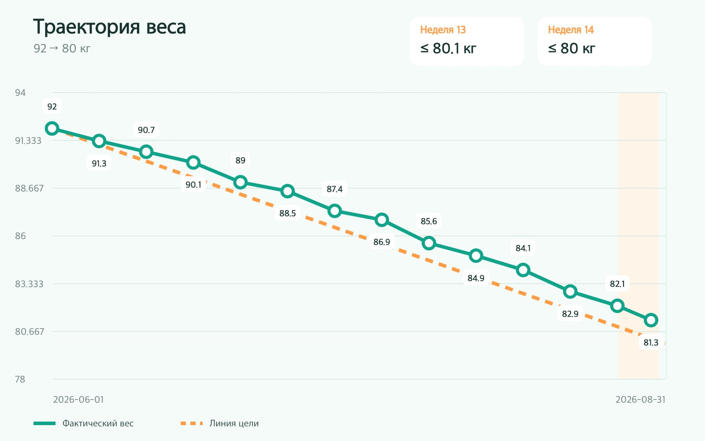

### 中文

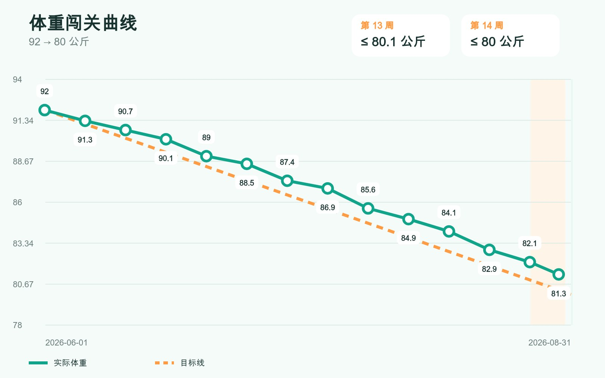

### Español

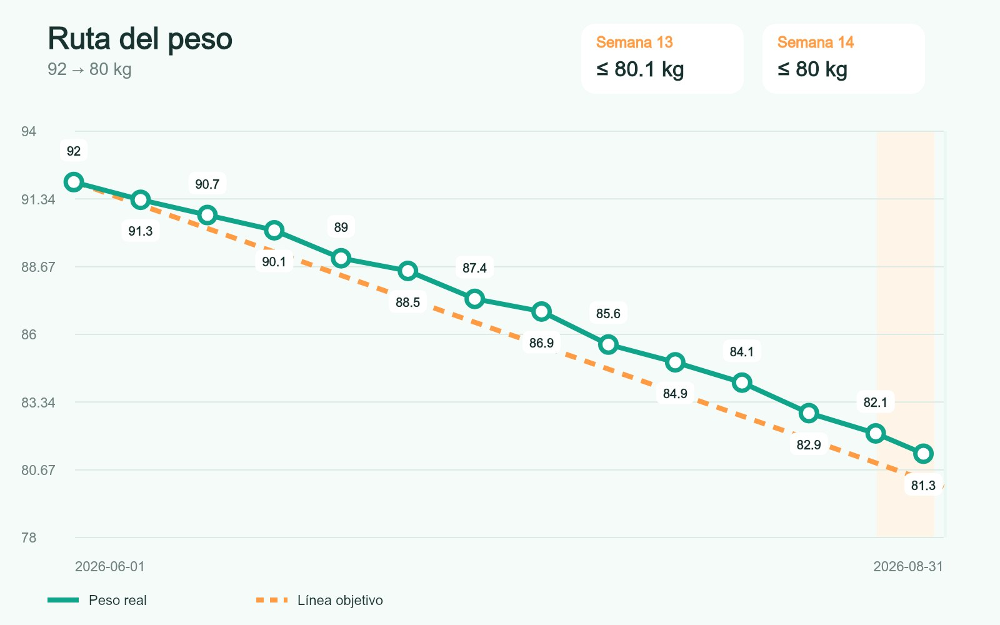

### Português

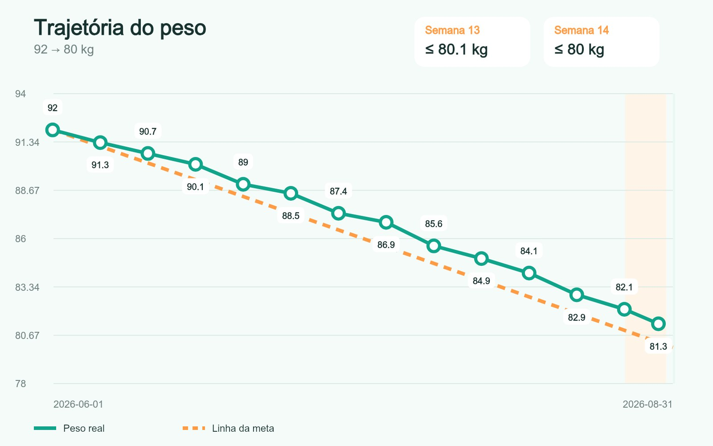

### Deutsch

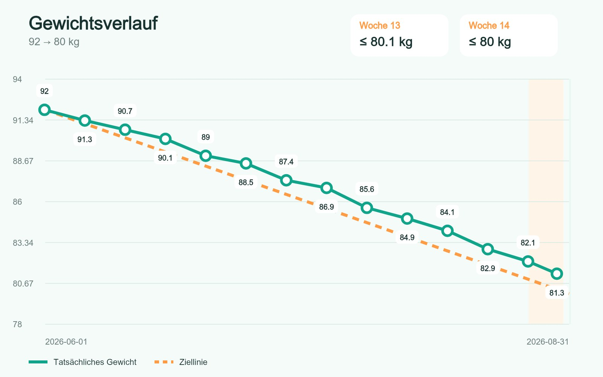

### Français


### 日本語

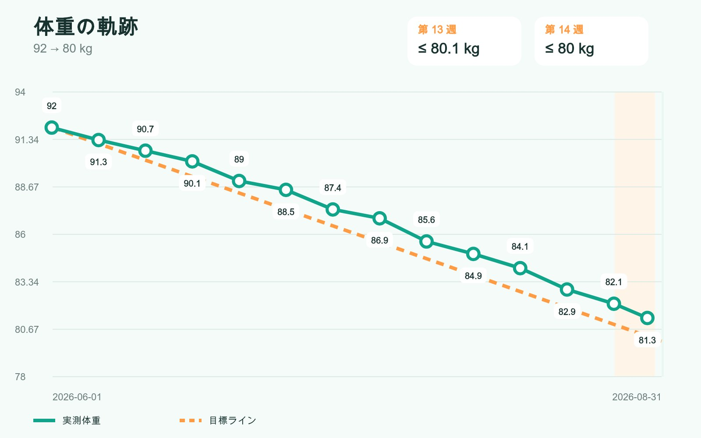

### Bahasa Indonesia


## Weekly roadmap after goal creation

Immediately after confirmation, the bot sends every weekly checkpoint with its date, target weight, and required loss in grams. Longer goals are split into a Telegram album without omitting any period.

### 6-month plan — English

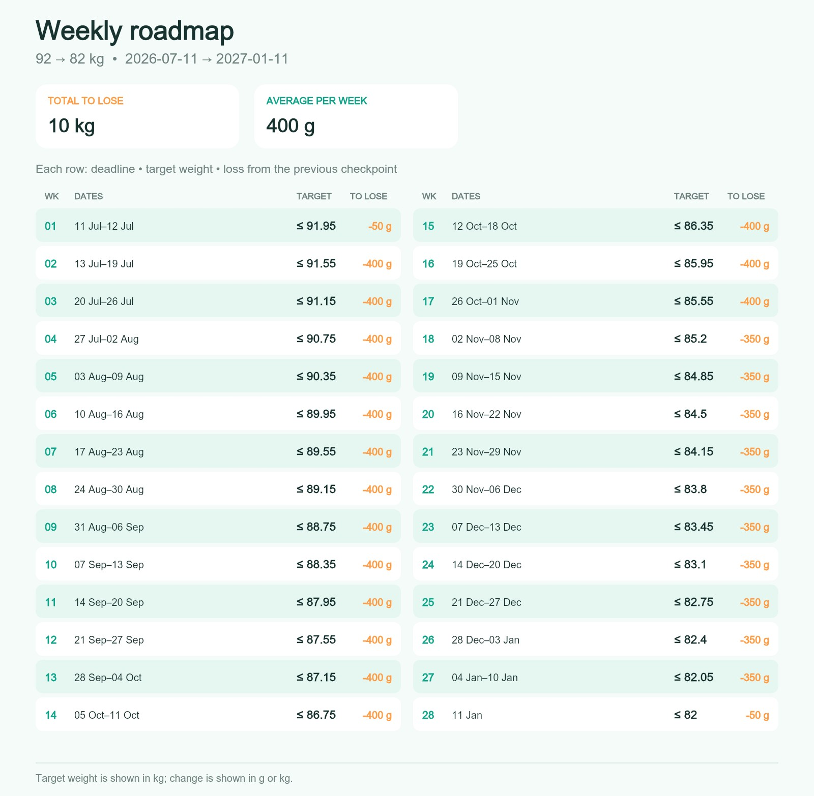

### План на 6 месяцев — Русский

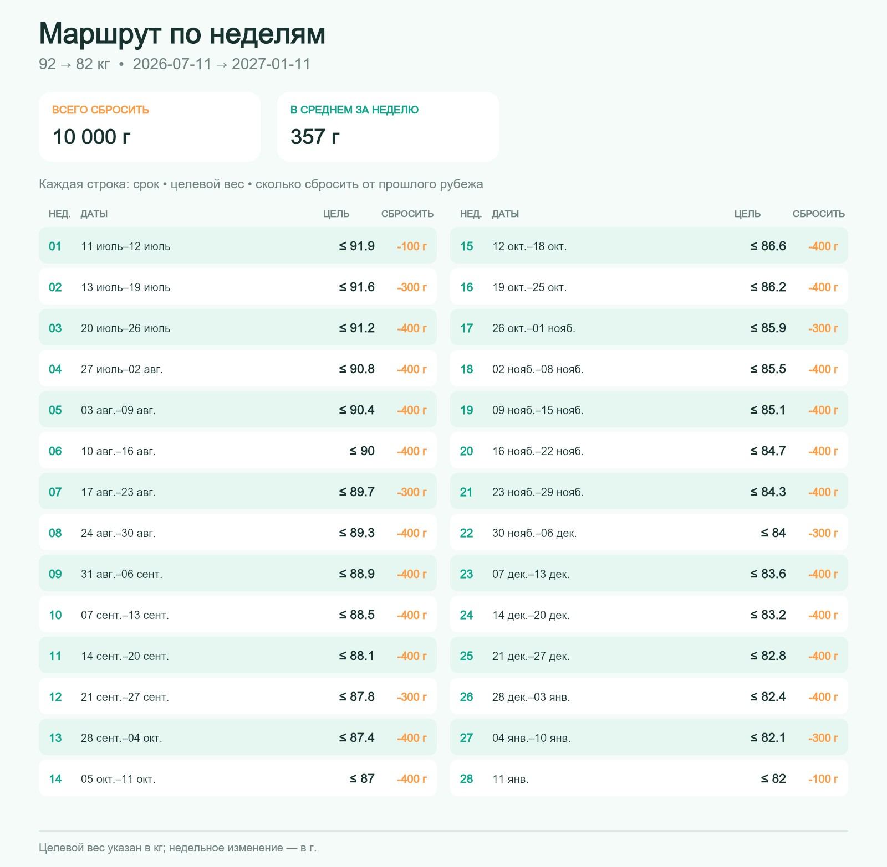

### 6 个月计划 — 中文

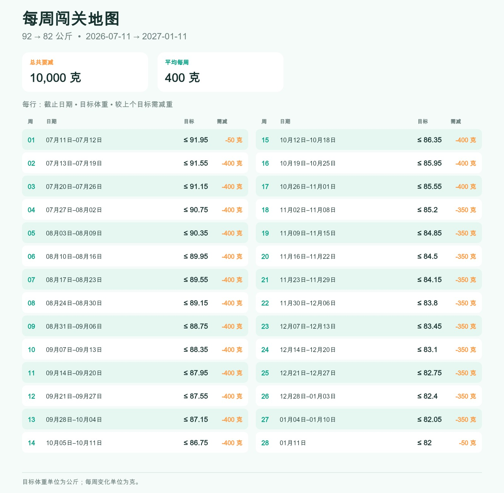

### 12-month plan — English

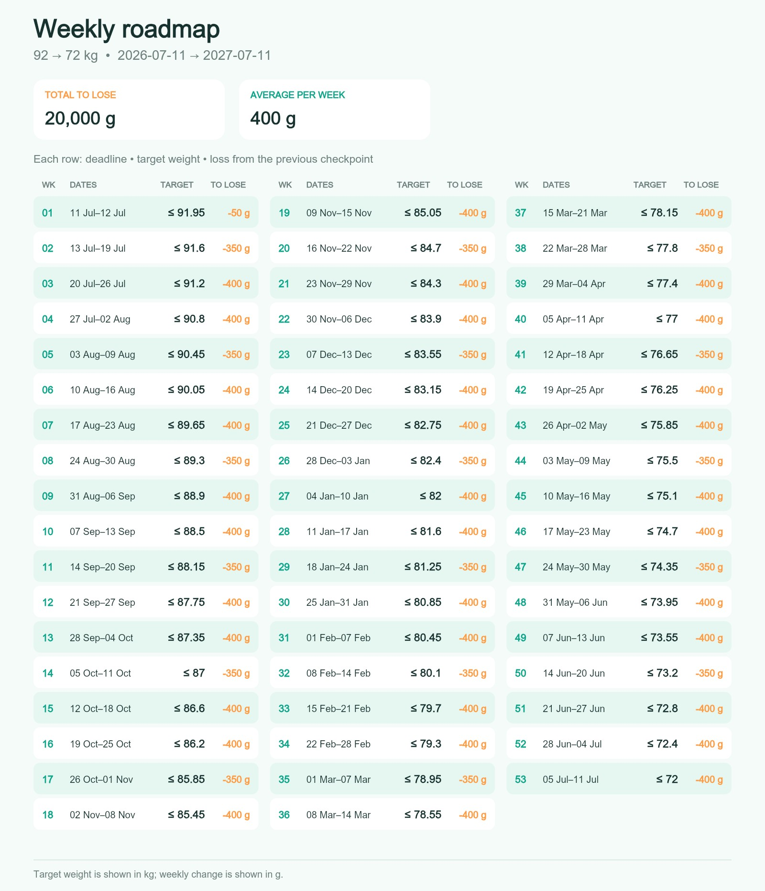

### План на 12 месяцев — Русский

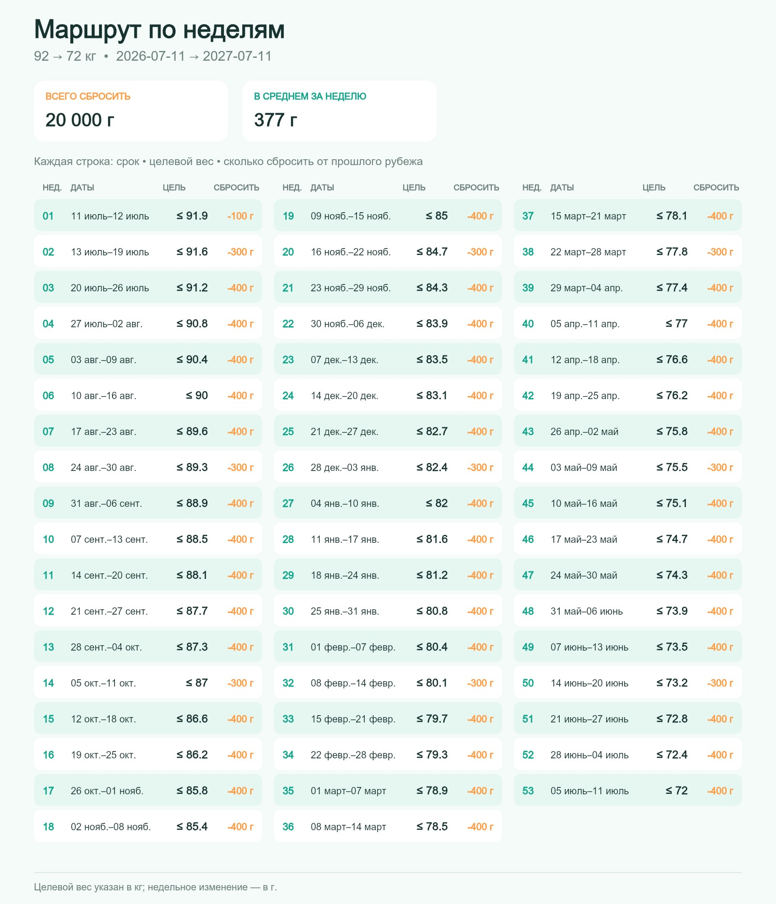

### 12 个月计划 — 中文

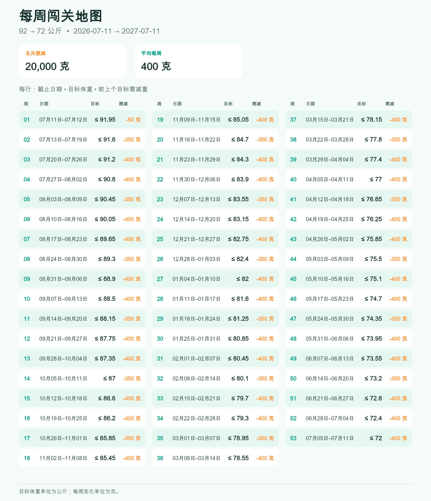

## Behavior

- Provides complete, naturally adapted interfaces in English, Russian, Chinese, Spanish, Portuguese, German, French, Japanese, and Indonesian.
- Works in group chats and reacts to a mention, a reply in an active wizard, or one of its buttons.
- Confirms active-goal replacement with Yes/No buttons, accepts the new starting photo by mention or prompt reply, and archives the old goal only after the new one is created.
- Lets users request goal status, progress charts, weekly plans, help, and language settings in private chat.
- Optionally notifies configured admin Telegram users about each new registration with platform user and goal-owner totals.
- Stores one active goal per Telegram user and preserves replaced/completed goal history.
- Requires each recorded weight to be attached to a new Telegram photo whose caption mentions the bot.
- Never downloads user photos; only Telegram's non-reusable `file_unique_id` is retained for duplicate detection.
- Calculates linearly interpolated checkpoints ending Sunday, with the final partial week ending on the exact goal date.
- Sends Thursday checkpoint reminders and a Sunday 10:00 reminder when the current week has no weight check-in.
- Generates progress charts in memory and rate-limits graphic responses to one album per user per minute.
- Uses 53 fixed, original bitmap achievements. Goals longer than 53 periods continue without additional badges.

## Local development

Requirements: Node.js 22+ and npm.

```bash
cp .env.example .env
npm install
npm run dev
```

The bot token must come from BotFather. Never commit `.env`.

Useful checks:

```bash
npm test
npm run lint
npm run typecheck
npm run build
npm run assets:validate
```

## Configuration

| Variable | Default | Purpose |
|---|---:|---|
| `TELEGRAM_BOT_TOKEN` | required | Rotated BotFather token |
| `TELEGRAM_WEBHOOK_SECRET` | required | Secret checked on every webhook request |
| `PUBLIC_BASE_URL` | `http://localhost:3000` | Public HTTPS origin in production |
| `DOCS_BASE_URL` | `https://igorshadurin.github.io/weight-telegram-bot` | Localized GitHub Pages instructions linked from private chat |
| `DATABASE_PATH` | `./data/bot.sqlite` | SQLite file path |
| `DEFAULT_LANGUAGE` | `ru` | First-contact fallback (`ru`, `en`, `zh`, `es`, `pt`, `de`, `fr`, `ja`, or `id`) |
| `APP_TIMEZONE` | `Europe/Minsk` | Calendar and reminder timezone |
| `REMINDER_WEEKDAY` | `4` | Luxon weekday (Thursday is 4) |
| `REMINDER_HOUR` | `10` | Local reminder hour |
| `REMINDER_MINUTE` | `0` | Local reminder minute |
| `SUNDAY_REMINDER_HOUR` | `10` | Sunday reminder hour when the current week has no check-in |
| `SUNDAY_REMINDER_MINUTE` | `0` | Sunday reminder minute |
| `GRAPHIC_COOLDOWN_SECONDS` | `60` | Per-user image cooldown |
| `ADMIN_TELEGRAM_USER_IDS` | empty | Comma-separated positive private-chat user IDs that receive new-user statistics |
| `PORT` | `3000` | HTTP port |

## Telegram setup

In BotFather:

1. Allow the bot to join groups.
2. Keep Group Privacy enabled. Mentioned commands, mentioned photo captions, and replies to the bot remain available.
3. Add the bot to the desired group.

The application sets its webhook and commands at startup when `PUBLIC_BASE_URL` uses HTTPS. Telegram calls:

```text
POST /telegram/webhook
X-Telegram-Bot-Api-Secret-Token: <TELEGRAM_WEBHOOK_SECRET>
```

Health checks use `GET /healthz`.

## Coolify deployment

- Build with the repository `Dockerfile` from `main`.
- Expose port `3000` and use `/healthz` as the health-check path.
- Mount persistent storage at `/app/data` and set `DATABASE_PATH=/app/data/bot.sqlite`.
- Configure the runtime environment variables above; do not expose secrets as build arguments.
- Run one replica because SQLite and the embedded durable scheduler are single-writer components.
- Enable automatic GitHub deployments. This installation uses Coolify's signed manual GitHub push webhook for the public repository.

## Achievement assets

Generated source PNG files live in `assets/achievements/originals`; Telegram-ready 1080×1350 JPEG files live in `assets/achievements/optimized`. The prompt manifest and progressive identity anchors are versioned with the project.

The square Telegram profile crop is versioned at `assets/mascot/avatar.jpg` and is derived from the canonical mascot anchor.

Regenerate derivative JPEGs and validate the collection with:

```bash
npm run assets:optimize
npm run assets:validate
npm run assets:contact-sheet
```

Achievement text is not rendered into the artwork. Exact localized names are sent as Telegram captions.

## Data and privacy

SQLite stores Telegram user/chat identifiers, language preference, goals, weekly periods, weights, non-reusable photo fingerprints, wizard state, deduplication IDs, rate-limit timestamps, and durable scheduled jobs. It does not store user photos or generated progress charts. Application logs intentionally omit message captions, weights, tokens, and photo fingerprints.

Webhook requests require Telegram's secret-token header, duplicate update IDs are ignored, SQL uses bound parameters, and the production container runs as an unprivileged user. Goal duration is bounded to prevent unbounded database allocation. GitHub secret scanning, push protection, Dependabot, pinned CI actions, npm auditing, and CodeQL provide ongoing repository checks. See [SECURITY.md](SECURITY.md) for private reporting.

This bot is motivational software, not medical advice.

## License

Licensed under the [Apache License 2.0](LICENSE).
